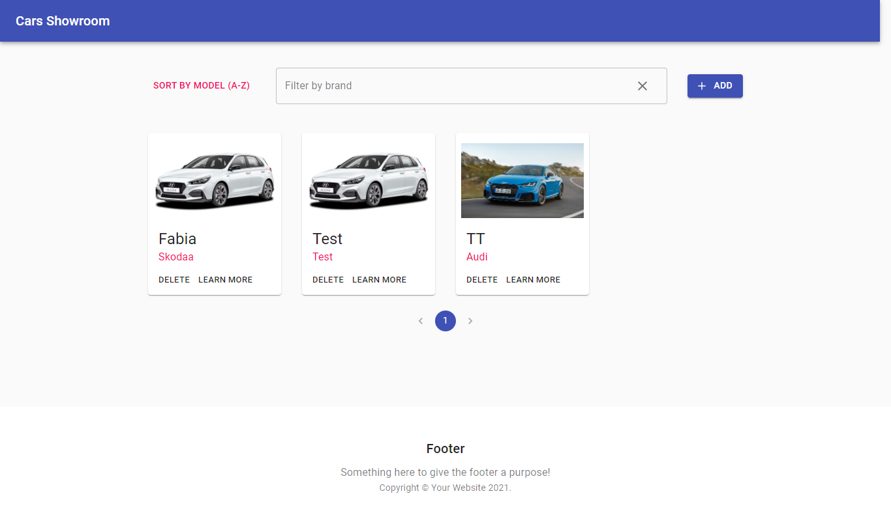
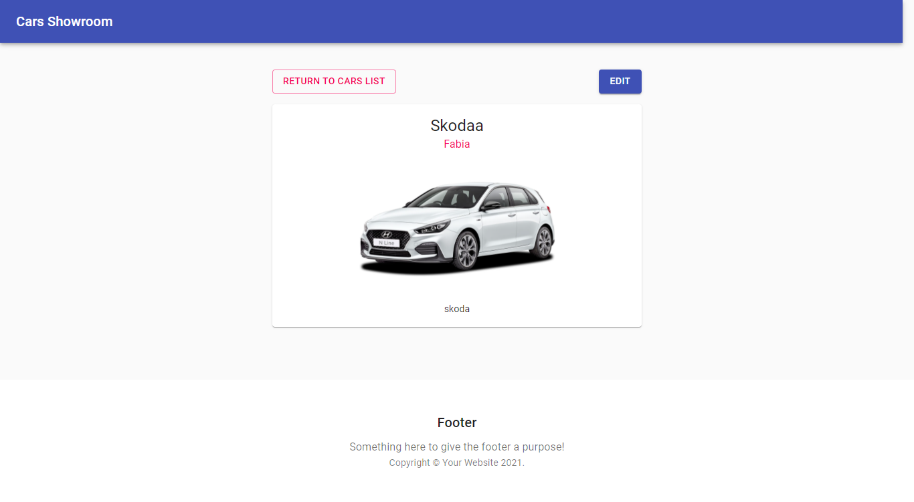
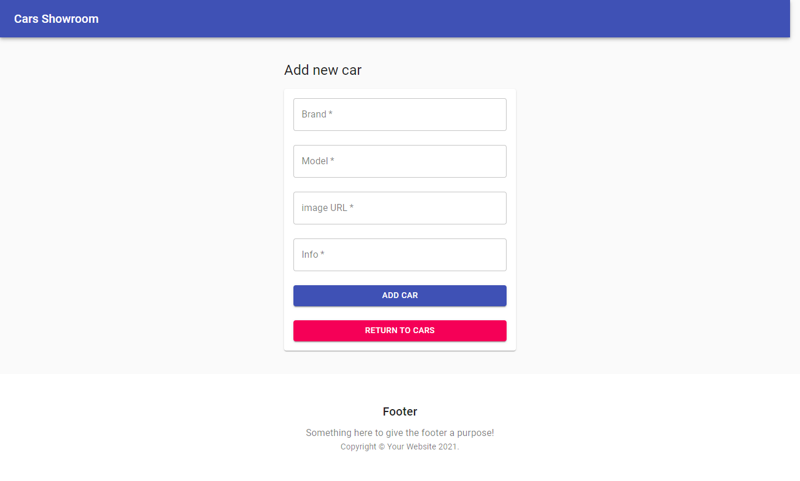
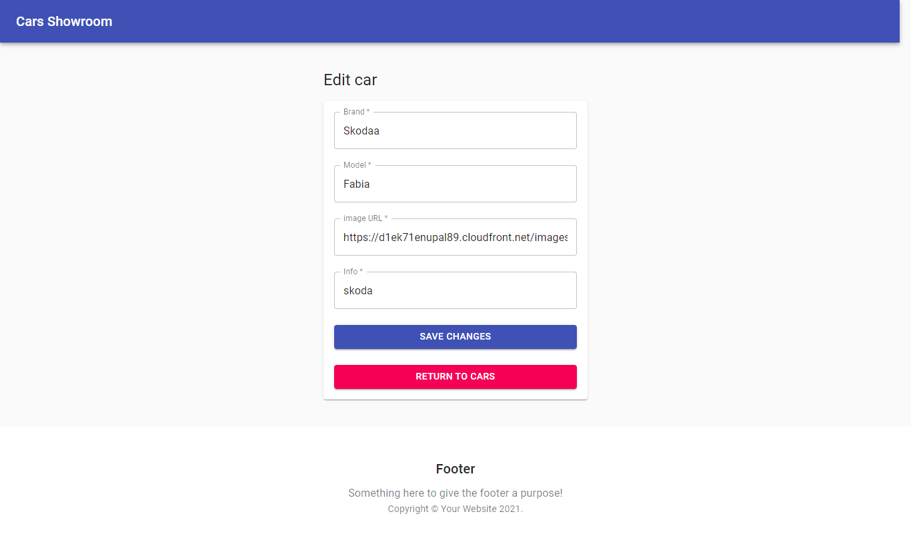

# Cars Showroom with React and Firebase

> Cars showroom is a simple app built with React, Firebase, MobX and Material UI.



Cars Showroom lists cars by model, brand. You can also add,edit or delete cars.

## Built With

- React
- Material UI
- MobX
- Firebase

## Live Demo

[Live Demo Link](https://cars-showroom.netlify.app/)

## Screenshots






## Getting Started

To get a local copy up and running follow these simple steps.

### Install

1. Clone the repo
   ```sh
   git clone https://github.com/AbdelkaderOumrani/CarsShowroom.git
   ```
2. Install dependencies
   ```sh
   yarn install
   ```

### Usage

```sh
   yarn start
```

### Run tests

### Deployment

## 🤝 Contributing

Contributions, issues, and feature requests are welcome!

Feel free to check the [issues page](../../issues/).

## Show your support

Give a ⭐️ if you like this project!
